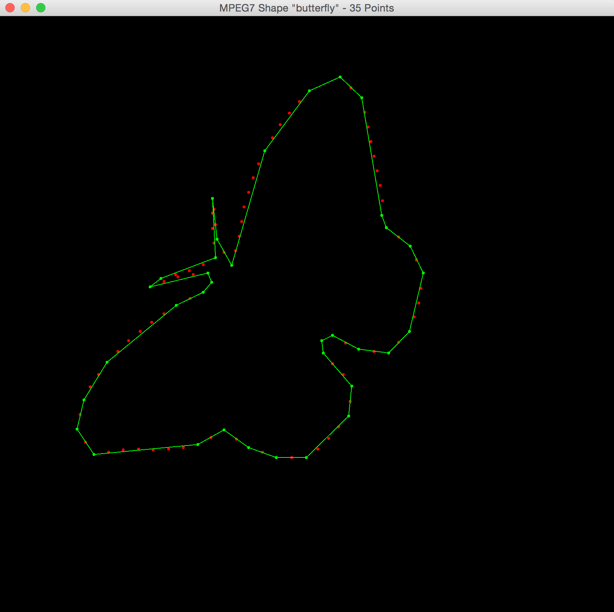

# draw-important-points
Stand-alone java application that draws shapes generated from the mpeg7 shape files, using a specified number of "important" points.

####Sample Output
Computation of the most "important" points determines how to redraw the original shape using a specified number of points. The original points are in red, and the shape drawn from the "important" points is outlined in green. Here's a JFrame generated window of the butterfly mpeg7 file, limited to 35 points:

